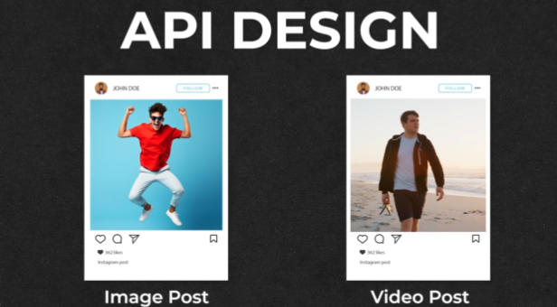
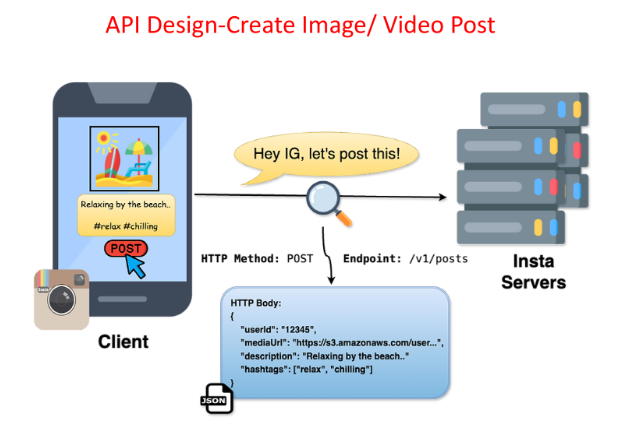

# **📡 API Design for Creating an Image or Video Post**

This section outlines the API design for creating an image or video post in the news feed system. It focuses on the structure and components of the API request, with special attention to handling media files.



---

## **🔍 Understanding the API Call**

The process for creating an image or video post is similar to creating a text post, but with an additional step for handling the media file. The API request still follows the RESTful design:



### **Step 1: Choose the HTTP Method**
- Use the **📤 `POST`** method to create a new post.

### **Step 2: Define the Endpoint**
- The endpoint remains the same: **📍 `/v1/posts`**.

### **Step 3: Construct the Request Body**
The request body includes the following fields:
- **🆔 `user_id`**: Identifies the user creating the post.
- **📝 `description`**: The text description of the post.
- **🏷️ `hashtags`**: A list of hashtags included in the post.
- **🖼️🎥 `media_url`**: **This is the key difference.** It contains the URL of the media file (image or video) that has been uploaded to object storage.

---

## **🖼️🎥 Handling Media Files**

Before sending the API request to create the post, the client must first upload the media file to object storage.

1. **📤 Upload Media to Object Storage**
   - The client uploads the media file (image or video) to a cloud storage service.
   - After a successful upload, the storage service returns a **🌐 URL** that points to the uploaded file.

2. **📦 Include Media URL in the Request**
   - The returned **`media_url`** is then included in the request body when calling the API endpoint.

---

## **📝 Example API Request**

Here is an example of the API request for creating an image or video post:

### **Request**
- **📤 Method:** `POST`
- **📍 Endpoint:** `/v1/posts`
- **📦 Body:**

```json
{  
  "user_id": "12345",  
  "description": "Enjoying a beautiful sunset!",  
  "hashtags": ["#sunset", "#nature", "#photography"],  
  "media_url": "https://cloud-storage.com/uploads/sunset-photo.jpg"  
}
```

By separating the media upload process and leveraging object storage, this design ensures 📈 scalability, reduces 🖥️ server load, and supports 💾 large media file uploads.

---

### 🔙 [Back](../README.md)