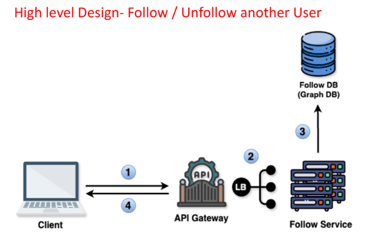

# **📊 High-Level Design for Following/Unfollowing a User**

This section outlines the high-level design for the follow/unfollow functionality in the news feed system.

---

## **🛠️ System Components and Flow**

The following steps describe the system's behavior when a user follows or unfollows another user:

1. **📱 Client Request**
   - The client sends a **📤 `POST`** request to the API gateway.
   - The request is sent to the **📍 `/v1/follow`** endpoint (as defined in the API design).
   - The request body includes:
      - **🆔 `follower_id`**: Identifies the user initiating the follow/unfollow action.
      - **🆔 `followee_id`**: Identifies the user being followed or unfollowed.

2. **🚪 API Gateway**
   - The API gateway receives the request and routes it to the appropriate service.
   - In this case, it forwards the request to the **🛠️ Follow Service** via a load balancer.

3. **🛠️ Follow Service**
   - The Follow Service handles the logic for following/unfollowing.
   - It updates the **🗄️ Follower Database** to store or remove the relationship between the users.
   - A **📊 graph database** is used to efficiently store and manage these relationships.

4. **✅ Confirmation**
   - Once the database is updated, the Follow Service sends a confirmation response back to the client through the API gateway.
   - The response includes a success status and any additional metadata, such as the updated follower count.

---

## **📊 Graph Database**

- **🎯 Purpose**:  
  Graph databases are specifically designed to store and query relationships between data points, such as follower/followee connections.

- **🔍 Relevance**:  
  In this system, relationships between users (e.g., who follows whom) are fundamental. Graph databases enable efficient retrieval of such connections, especially for features like suggesting mutual friends or recommending users to follow.

---

## **📈 Scalability Considerations**

- **🌐 High Volume of Connections**:  
  The system must support millions of users and their relationships.
   - A graph database with efficient indexing and querying capabilities ensures scalability.

- **⏱️ Real-Time Updates**:  
  Updates to the follower relationships must be processed in real-time to reflect in users' newsfeeds and suggestions.

---

**This design ensures 🎯 efficient handling of follow/unfollow operations while maintaining 📈 scalability and ⚡ performance for a large user base.**

---
### 🔙 [Back](../README.md)