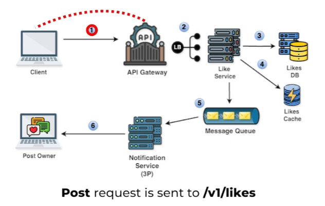
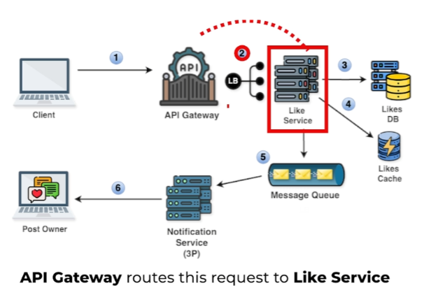
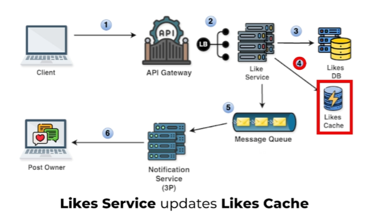
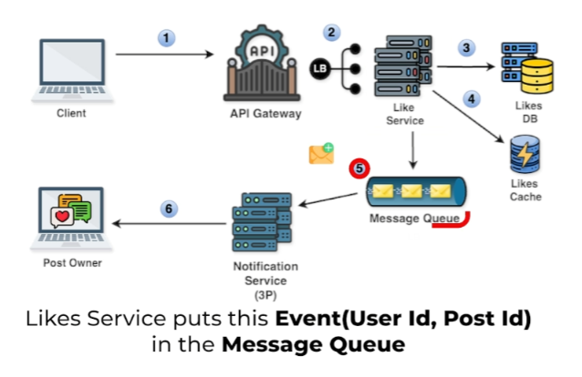
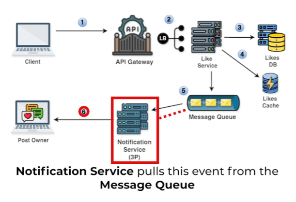
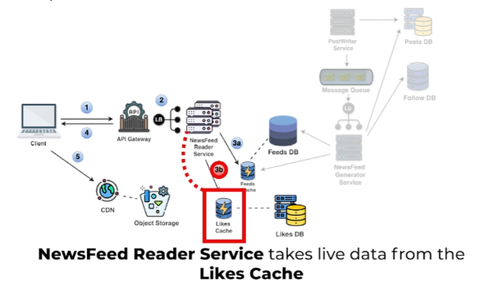

# **📊 High-Level Design for Liking a Post**

This section outlines the high-level design for the liking functionality in the news feed system, including the notification mechanism and integration with the news feed display. It also highlights the importance of the **Likes Cache** for efficient like count retrieval.

---

## **🛠️ System Components and Flow**

The following steps describe how the system handles a user liking a post:

### **Step 1: Client Submits Like**

- The user clicks the **❤️ like button**.
- A **📤 `POST`** request is sent to the API gateway, targeting the **📍 `/v1/likes`** endpoint.
- The request includes the **🆔 `user_id`** (who liked the post) and **🆔 `post_id`** (the post being liked).

### **Step 2: API Gateway Routing**

- The API gateway receives the request and routes it to the **❤️ Like Service** via a load balancer.
- The gateway ensures the request reaches the appropriate service for processing.

### **Step 3: Like Service Processing**

- The **❤️ Like Service** processes the like request and stores it in the **🗄️ Likes Database**.
- The database keeps track of each like, associating it with the user and the post.

### **Step 4: Update Likes Cache**

- To speed up access, the **❤️ Like Service** updates the **🧠 Likes Cache**.
- The cache stores a mapping between **🆔 `post_id`** and its corresponding **🔢 `likes_count`**. This allows for quick retrieval of like counts.

### **Step 5: Add Event to Message Queue**

- The **❤️ Like Service** adds an event to the **📨 Message Queue**, containing the **🆔 `user_id`** (who liked the post) and **🆔 `post_id`**.
- This event triggers the **🔔 Notification Service** to notify the post owner about the new like.

### **Step 6: Notification Service**

- The **🔔 Notification Service** (a third-party service) pulls the event from the message queue.
- It uses the event data to identify the post owner and send them a notification about the new like.

### **Step 7: Post Owner Notification**

- The post owner receives the notification and is happy about the new like.
- This ensures the post owner stays engaged with interactions on their content.

---

## **📰 Integration with News Feed**

To display the correct like count in the news feed, the following step is added to the news feed retrieval process:

### **Step 3B: Fetch Like Count from Cache**
- The **📰 Newsfeed Reader Service** retrieves the like count for each post from the **🧠 Likes Cache**.
- This ensures the like count is displayed quickly without querying the database every time the news feed is loaded.

---

## **🧠 Importance of the Likes Cache**

The **Likes Cache** plays a crucial role in optimizing the display of like counts. Here's why:

- **⚡ Efficiency:** The cache provides very fast access to like counts, avoiding querying the database for every news feed request.
- **📈 Scalability:** By reducing database load, the cache helps the system handle a large number of users and requests efficiently.
- **✨ Improved User Experience:** Users see accurate like counts in their news feed without experiencing delays or performance issues.

---

### **📝 Example:**

Imagine a scenario with millions of users and posts. Without the **🧠 Likes Cache**, the system would need to query the database every time a user views their news feed to retrieve the like count for each post. This would significantly impact performance and scalability. The **🧠 Likes Cache** solves this problem by storing the like counts in memory, allowing for quick and efficient retrieval.

---

**This design ensures that likes are processed efficiently, notifications are delivered in a timely manner, and users can view accurate like counts with minimal impact on system performance.**

---
### 🔙 [Back](../README.md)