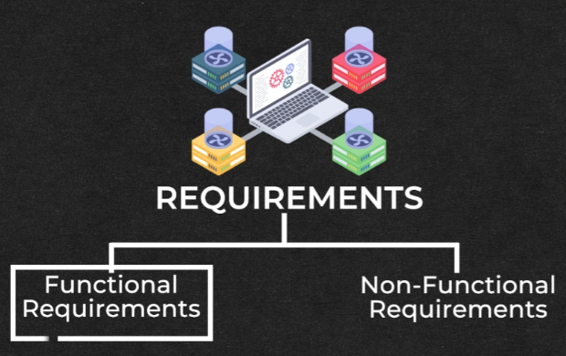
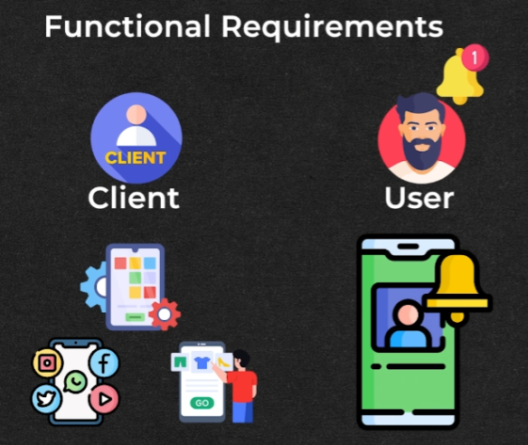
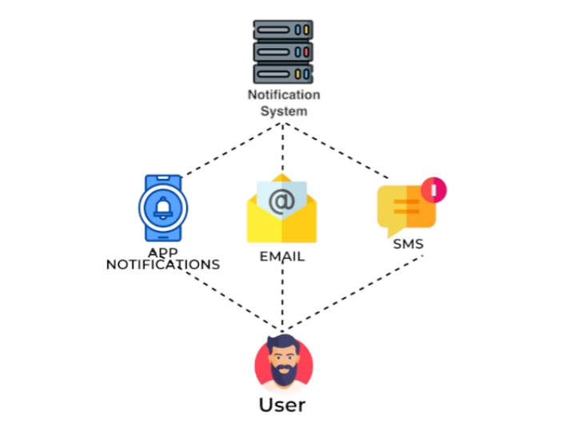
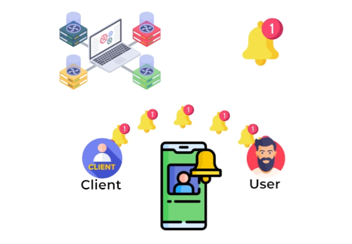
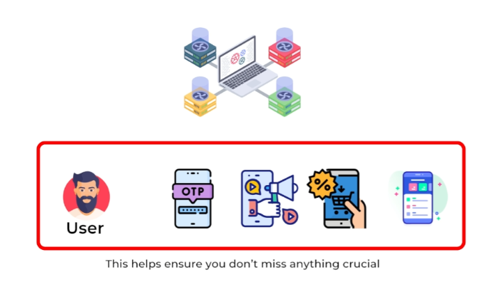
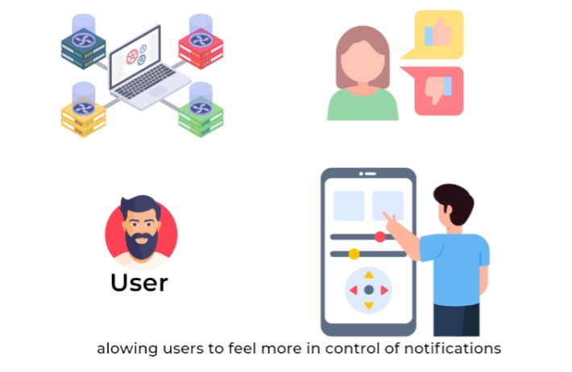
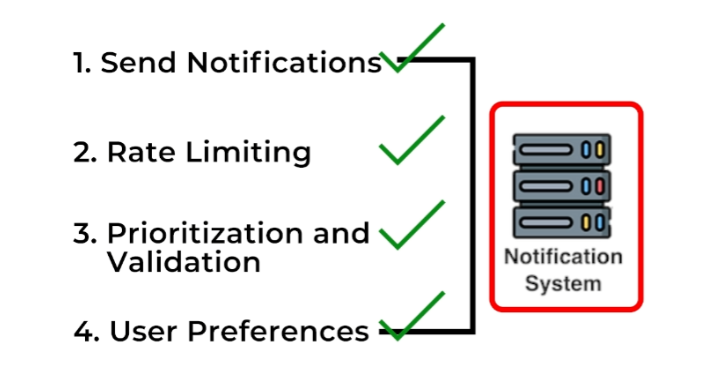

# **📋 Functional Requirements for a Notification System**

---

## **1️⃣ Key Concepts**

### **👥 Clients**

Applications or services that send notifications (e.g., social media apps, online stores).

### **👤 Users**

Individuals who receive notifications on their devices.

---

## **2️⃣ Functional Requirements**

---

### **1. 📤 Send Notifications**

* **📝 Requirement**: The system must enable clients to send notifications to users.
* **📨 Delivery Channels**: Notifications should be delivered through multiple channels: SMS, email, and in-app notifications.
* **💡 Rationale**: Multi-channel delivery ensures users receive messages in the formats they prefer and are most likely to engage with.

---

### **2. ⏳ Rate Limiting**

* **📝 Requirement**: The system must control the rate of notification delivery to prevent users from being overwhelmed.
* **✅ Benefits**:
  * Prevents notification overload and spam.
  * Manages server load during peak traffic.

---

### **3. ⚡ Prioritization and Validation**

* **📝 Requirement**: The system should prioritize critical notifications (e.g., OTPs) over less urgent ones (e.g., promotional messages).
* **🔒 Validation**: The system must validate notification content and the recipient’s identity before sending.
* **✅ Benefits**:
  * Ensures timely delivery of critical alerts.
  * Enhances security and prevents unauthorized notifications.

---

### **4. ⚙️ User Preferences**

* **📝 Requirement**: The system must respect user preferences regarding notification frequency, types, and channels.
* **✅ Benefits**:
  * Creates a user-centric experience.
  * Reduces unnecessary interruptions.
  * Gives users control over their notification experience.

---

## **3️⃣ Conclusion**

These functional requirements form the foundation of a well-designed notification system. By addressing these requirements, the system can effectively deliver information to users while respecting their preferences and ensuring a positive experience.

---

### 🔙 [Back](../README.md)