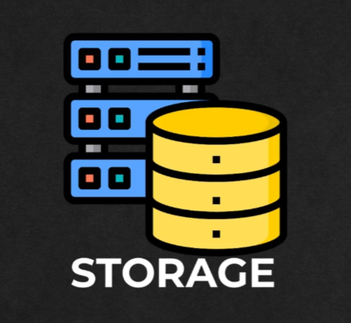
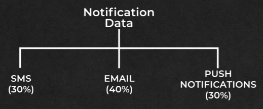
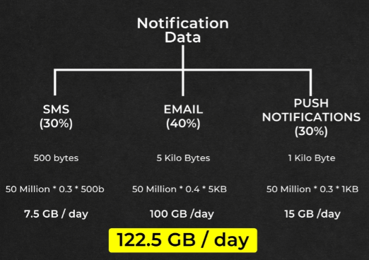
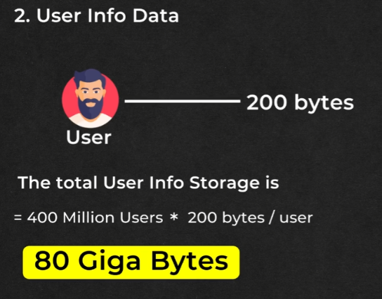
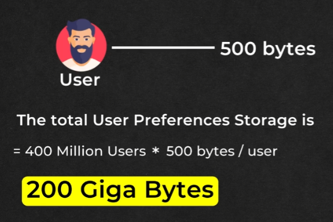
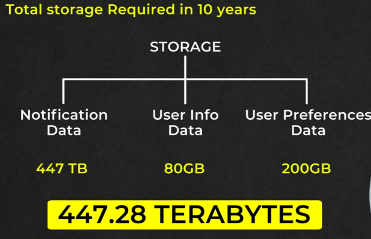

# **📊 Capacity Planning: Storage Estimation**

This document details the storage estimation for a notification system, considering the various types of data that need to be stored and their respective sizes.

---

## **📂 Types of Data**

The notification system primarily stores three types of data:

1. **📨 Notification Data:** This includes the content and metadata of the notifications themselves.
2. **👤 User Info Data:** This comprises basic information about the users, such as their preferences, contact details, and notification history.
3. **📝 System Logs:** These are records of system operations, including successful and failed notifications, system errors, and performance metrics.

---

## **📋 Factors Affecting Storage Requirements**

1. **📅 Data Retention Policies:**
    * Define how long the system must retain notification data, user info, and logs.
    * Longer retention policies require more storage capacity.

2. **📈 Frequency and Volume of Notifications:**
    * The higher the number of notifications sent daily, the greater the storage requirement for logs and metadata.

3. **📦 Data Compression:**
    * Utilizing compression techniques can significantly reduce storage requirements.

4. **🗄️ Archival Strategies:**
    * Storing older data in less expensive, slower-access storage can optimize storage costs.

---

## **📝 Estimation Methodology**

1. **📏 Determine Data Sizes:**
    * Calculate the average size of each notification, user record, and log entry.

2. **📊 Estimate Daily Data Volume:**
    * Multiply the average sizes by the expected daily volume of notifications, user interactions, and system events.

3. **📅 Apply Retention Policies:**
    * Multiply the daily data volume by the retention period to determine total storage needs.

4. **📈 Include Growth Factors:**
    * Account for user base growth and increasing notification volumes over time.

5. **🔒 Factor in Redundancy:**
    * Add storage overhead for backups and fail-over systems.

---

## **📊 Example Calculation**

* **📨 Notification Data:**
    * **📱 SMS (30%)**
        * 500 bytes
        * 50 Million \* 0.3 \* 500b
        * 7.5 GB / day
    * **📧 EMAIL (40%)**
        * 5 Kilo Bytes
        * 50 Million \* 0.4 \* 5KB
        * 100 GB / day
    * **📲 PUSH NOTIFICATIONS (30%)**
        * 1 Kilo Byte
        * 50 Million \* 0.3 \* 1KB
        * 15 GB / day
    * **📊 Result:**
        * **122.5GB / day**
    * **📅 Calculate for 10 years:**
        * **122.5 GB / day \* 365 days \* 10 years**
        * **447 Tera Bytes**

---

### **👤 User Info Data**

  

---

### **⚙️ User Preferences Data**

  

---

## **🎯 Conclusion**

By carefully estimating storage needs based on data types, volumes, and retention policies, a notification system can ensure it has adequate capacity to handle current and future demands.

---

### 🔙 [Back](../README.md)