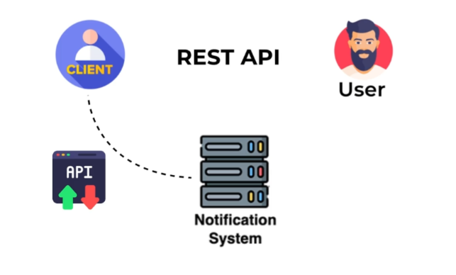
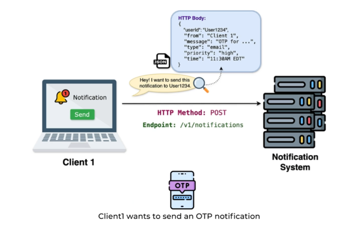

# **📡 API Design: Sending a Notification**

This document outlines the API design for sending a notification through the notification system. It describes the structure and components of the API request, leveraging a RESTful approach for communication.

---

## **📋 Overview**

The notification system allows clients to send notifications, such as OTPs or alerts, to users. This document explains how to interact with the system and the technical details of making an API call.



---

## **📨 Communication Flow: An Example**

Imagine a scenario where a client, like a social media app, wants to send an OTP notification to a user. The interaction would be as follows:



**Client:** "Hey Notification System, I want to send this OTP notification to user 1234."

**Notification System:** (Validates the request, processes it, and if everything is correct) "OK, I'll deliver the notification to user 1234."

---

## **🔧 Technical Details of the API Call**

---

### **1. 🌐 HTTP Method**

* **Method:** `POST`
    * **Purpose:** Indicates the action to be performed on the server.
    * **Rationale:** `POST` is used because the request creates a new notification resource on the server.

---

### **2. 📍 Endpoint**

* **URL:** `/v1/notifications`
    * **Purpose:** Specifies where the action should be performed.
    * **Versioning:** The `v1` prefix denotes version 1 of the API. Versioning helps manage updates and changes in the API.

---

### **3. 📄 Request Body**

The request body contains the data required to create a notification. It should be in JSON format with the following structure:

#### **📝 Example Request Body**
```
{  
  "userId": "1234",  
  "type": "otp",  
  "message": "Your OTP is 567890",  
  "channel": "sms",  
  "metadata": {  
    "expiry": "2025-01-21T00:00:00Z"  
  }  
}
```

* **Fields:**
    * `userId`: The unique identifier of the user to whom the notification will be sent.
    * `type`: The type of notification (e.g., `otp`, `alert`).
    * `message`: The content of the notification.
    * `channel`: The delivery channel (e.g., `sms`, `email`).
    * `metadata`: Additional optional information, such as expiry time.

---

### **4. 📤 Response**

#### **✅ Successful Response**

* **Status Code:** `200 OK`

**Response Body:**
```
 {  
  "status": "success",  
  "notificationId": "abc123",  
  "message": "Notification sent successfully"  
}
```

---

#### **❌ Error Responses**

* **Invalid Request:**

    * **Status Code:** `400 Bad Request`

**Response Body:**
```
 {  
  "status": "error",  
  "message": "Invalid request data"  
}
```

---

* **Server Error:**

    * **Status Code:** `500 Internal Server Error`

**Response Body:**
```
 {  
  "status": "error",  
  "message": "Something went wrong. Please try again later."  
}
```

---

## **🔒 Additional Considerations**

1. **🔑 Authentication:**
    * Use API keys or OAuth tokens to authenticate API requests.

2. **⏳ Rate Limiting:**
    * Implement rate limits to prevent abuse and ensure fair usage.

3. **📊 Logging and Monitoring:**
    * Log API requests and responses for troubleshooting and performance monitoring.

---

## **🎯 Conclusion**

This API design provides a robust and straightforward way to send notifications to users. By adhering to RESTful principles, it ensures clarity and scalability for future enhancements.

---

### 🔙 [Back](../README.md)