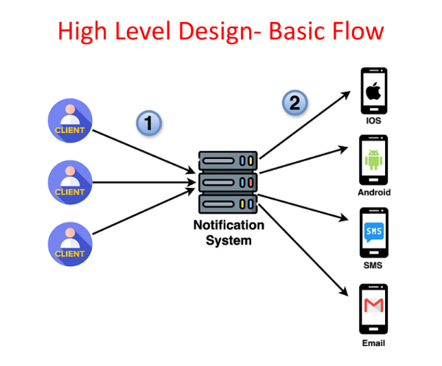
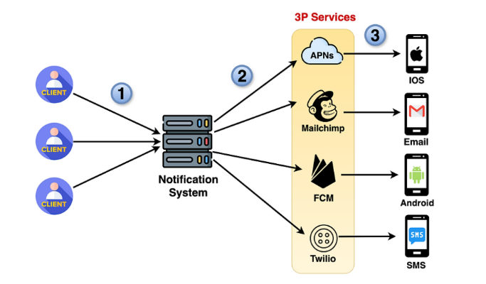

# **📡 High-Level Design: Basic Flow and Third-Party Services**

This document outlines the high-level design of the notification system, focusing on the basic flow of notification delivery and the integration with third-party services.

---

## **📨 Basic Notification Flow**

The core functionality of the notification system involves receiving notifications from clients (e.g., social media apps, e-commerce platforms) and delivering them to the target users. This basic flow can be visualized as follows:

* **👥 Clients:** Send notification requests to the notification system.
* **📡 Notification System:** Processes the requests and routes them to the appropriate delivery channels.
* **📤 Delivery Channels:** Include various notification types like iOS push notifications, Android push notifications, SMS, and email.

---

## **📱 Example: iOS and Android Push Notifications**

---

### **🍎 iOS Push Notification**

1. **📨 Client Request:** A client (e.g., Facebook) sends a request to the notification system to deliver a push notification to an iOS user.
2. **🔍 Validation:** The notification system validates the request, checking the sender and recipient information.
3. **⚙️ Processing:** The system processes the notification and creates a record in the database.
4. **🔗 Connect to Apple Servers:** The system establishes a connection with Apple Push Notification service (APNs).
5. **📤 Send Notification:** The notification is sent to APNs using Apple's APIs.
6. **✅ Delivery and Confirmation:** APNs deliver the notification to the target device and confirm the delivery status.

---

### **🤖 Android Push Notification**

1. **📨 Client Request:** A client (e.g., Amazon) sends a request to the notification system to deliver a push notification to an Android user.
2. **🔍 Validation:** The notification system validates the request, verifying sender and recipient details.
3. **⚙️ Processing:** The system processes the request and logs it in the database.
4. **🔗 Connect to Google Servers:** The system establishes a connection with Firebase Cloud Messaging (FCM).
5. **📤 Send Notification:** The notification is sent to FCM using Google's APIs.
6. **✅ Delivery and Confirmation:** FCM delivers the notification to the Android device and provides delivery status updates.

---

## **🤝 Integration with Third-Party Services**

The notification system relies on third-party services for final delivery of notifications. These services include:

1. **🍎 Apple Push Notification service (APNs):** Used for delivering notifications to iOS devices.
2. **🤖 Firebase Cloud Messaging (FCM):** Facilitates notification delivery to Android devices.
3. **📱 SMS Gateways:** Partners like Twilio or Nexmo enable SMS delivery.
4. **📧 Email Providers:** Integration with services like SendGrid or Amazon SES ensures email notifications are sent efficiently.

---

### **🔑 Key Design Considerations**

* **📈 Scalability:** The system is designed to handle a high volume of notifications by leveraging load balancing and horizontal scaling.
* **🔄 Retry Mechanism:** In case of failures, the system retries delivery using exponential backoff.
* **📊 Monitoring and Logging:** Comprehensive logging and monitoring ensure issues are detected and resolved promptly.
* **🔒 Security:** Data is encrypted during transit and at rest, ensuring compliance with privacy regulations.

By following this high-level design, the notification system ensures reliable and efficient delivery of messages to users across different platforms.

---

### 🔙 [Back](../README.md)