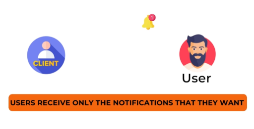
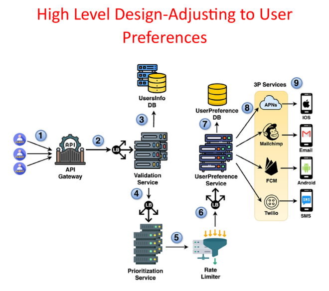

# **📡 High-Level Design: Integrating User Preferences**

This document explains how to incorporate user preferences into the notification system's design to ensure that users receive only the notifications they desire.

---

## **🌟 The Importance of User Preferences**

User preferences play a vital role in providing a personalized and relevant notification experience. Users should have the ability to control the types of notifications they receive, the channels through which they receive them, and the frequency of those notifications.

**📊 Examples:**

* A user might choose to receive only email notifications for marketing promotions and not SMS messages.
* A user might set a limit on the number of promotional notifications they receive per month.

By respecting user preferences, the notification system can avoid overwhelming users with irrelevant or unwanted messages, leading to a more positive user experience.

---

## **🛠️ Introducing the User Preference Service**

To manage user preferences effectively, we introduce the **User Preference Service** into our system design. This service interacts with a **User Preference Database** to store and retrieve individual user preferences.

---

## **📨 Modified Notification Flow**

The updated notification flow with the User Preference Service is as follows:

1. **📨 Client Request:** The client sends a notification request to the API gateway.
2. **🛣️ API Gateway Routing:** The API gateway routes the request to the Validation Service.
3. **🔍 Validation:** The Validation Service validates the recipient information.
4. **🚦 Prioritization:** The Prioritization Service assigns a priority level to the notification.
5. **⏳ Rate Limiting:** The Rate Limiter checks the frequency of notifications sent to the user.
6. **⚙️ User Preference Check:** The User Preference Service verifies the notification against the user’s preferences (e.g., channel, type, frequency).
7. **📤 Delivery Routing:** Notifications that pass all checks are routed to the appropriate Notification Sender Service.
8. **📤 Notification Delivery:** The notification is sent to the user through the specified channel (e.g., email, SMS, push notification).

---

By integrating user preferences into the notification flow, the system ensures that only relevant and desired notifications are sent to users, enhancing their experience and satisfaction.

---

### 🔙 [Back](../README.md)