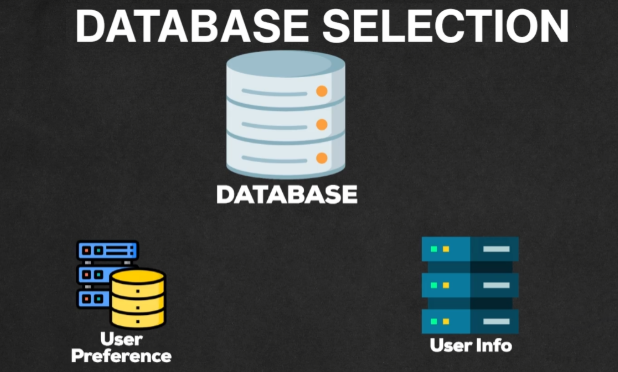
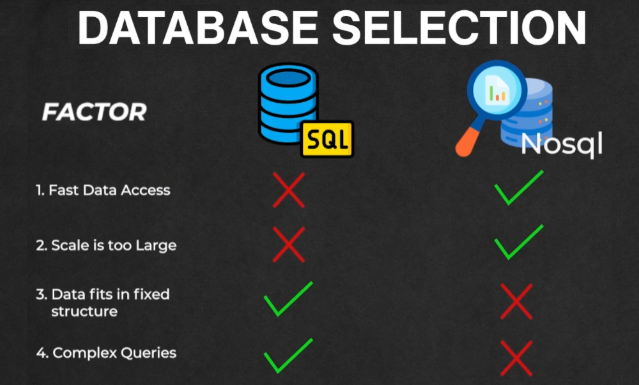
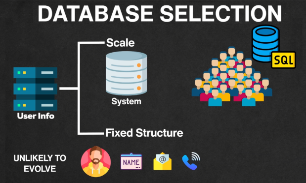
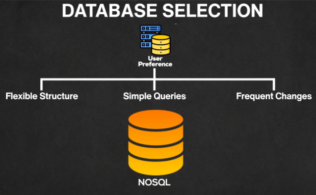

# **🗄️ Deep Dive: Database Selection**

This section explains the process of selecting appropriate database types for the notification system, considering various factors and guidelines.

---

## **📋 General Guidelines for Database Selection**

Choosing the right database is crucial for system performance and scalability. While project-specific needs ultimately guide the decision, the following general guidelines can help:

* **⚡ Fast Data Access:** NoSQL databases are generally preferred when low latency and fast data retrieval are critical.
* **📊 Large Scale:** NoSQL databases tend to outperform SQL databases when handling very large datasets and high throughput.
* **📐 Fixed Data Structure:** SQL databases are well-suited for data with a fixed schema and relationships between tables.
* **🔍 Complex Queries:** SQL databases excel at handling complex queries involving joins and aggregations.
* **🔄 Evolving Data:** NoSQL databases are more suitable for data that changes frequently or may evolve over time due to their flexible schema.

---

## **📂 Database Selection for Notification System Components**

---

### **1. 👤 User Info Database**

* **🔑 Factors:**
  * **📏 Moderate Scale:** The user base is large, but the scale of data in the User Info Database is moderate compared to other parts of the system.
  * **📐 Fixed Structure:** User information (name, email, phone) has a fixed structure and is unlikely to change significantly.
* **✅ Choice:** SQL database. It is well-suited for structured data and moderate scale.

---

### **2. ⚙️ User Preference Database**

* **🔑 Factors:**
  * **🌀 Flexible Structure:** User preferences can evolve over time with new notification types and channels, requiring a flexible schema.
  * **🔍 Simple Queries:** Queries are straightforward, mainly fetching preferences by user ID.
  * **🔄 Frequent Changes:** User preferences can change often, requiring an adaptable data structure.
* **✅ Choice:** NoSQL database. Its flexible schema and ability to handle frequent changes make it a good fit for storing user preferences.

---

### 🔙 [Back](../README.md)