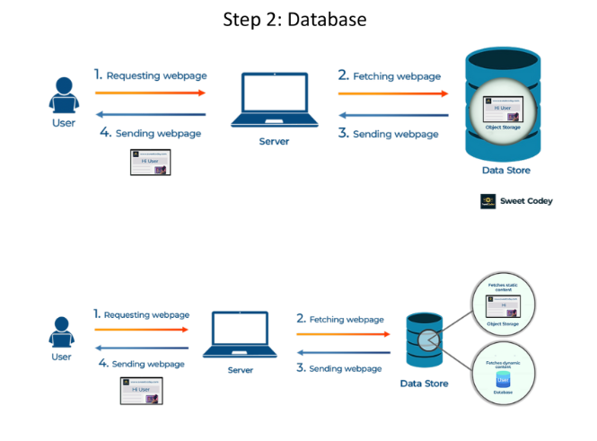

# **🌐 Client & Server: The Foundation of System Design**

This document explores the fundamental concepts of client-server architecture, the backbone of modern system design. Understanding this interaction is crucial for building scalable and efficient systems.

---

## **⚠️ The Problem: How Does the Web Work?**

When you open your browser, type a website address, and hit enter, the website appears on your screen. But how does this happen? Behind the scenes, it’s not magic—it’s the result of a well-orchestrated interaction between two key components: the **client** and the **server**.

---

## **🛠️ The Solution: Client-Server Architecture**

To understand this interaction, let’s break it down into its core components and their roles.

---

### **💻 Client: The Request Initiator**

A client is any device that requests information or services. This could be:
- Your smartphone 📱
- Your laptop or computer 💻
- Any device capable of sending a request 🌐

The client initiates the process by making a request to the server.

---

### **🖥️ Server: The Request Handler**

A server is a computer or device that listens for client requests, processes them, and sends back the appropriate response. In the context of a website:
- The server stores the website’s data and files. 🗄️
- It processes the client’s request and returns the requested webpage. 📄

---

## **✅ Benefits of Client-Server Architecture**

* **🌐 Scalability:** Servers can handle multiple client requests simultaneously, making the system scalable.
* **🔒 Centralized Control:** Data and resources are managed centrally on the server, ensuring consistency and security.
* **🔄 Separation of Concerns:** Clients and servers operate independently, allowing for modular and maintainable system design.

---

## **📨 The Request Flow: How Clients and Servers Interact**

1. **📨 Client Request:** You, the client, make a request by typing a URL or clicking a link.
2. **🚦 Server Processing:** The server receives the request, processes it, and retrieves the necessary data.
3. **📤 Server Response:** The server sends the requested webpage or data back to the client.
4. **🖥️ Client Rendering:** The client (e.g., your browser) displays the webpage or processes the data.

---

## **🔍 Further Details: What Happens Behind the Scenes?**

While the above flow is a high-level overview, there’s much more happening under the hood:
- **DNS Resolution:** Translating the website address (URL) into an IP address. 🔍
- **Load Balancing:** Distributing requests across multiple servers to ensure efficiency. ⚖️
- **Database Queries:** Fetching data from databases to fulfill the request. 🗃️

We’ll explore these concepts in more detail in upcoming sections.

---

By understanding the client-server architecture, you gain a solid foundation for designing systems that are scalable, reliable, and efficient. This knowledge is essential for tackling more complex system design challenges.

---

### 🔙 [Back](../README.md) ↩️