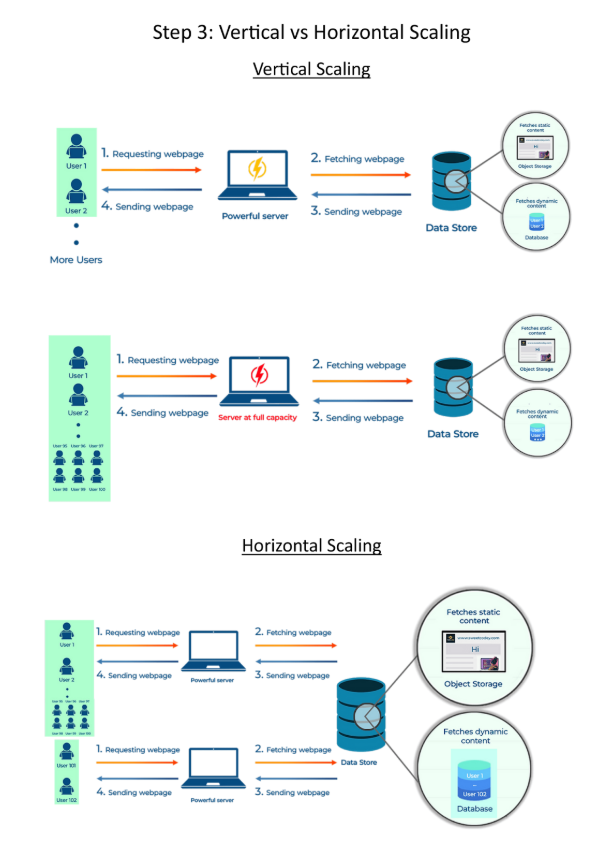

# **📈 Vertical vs. Horizontal Scaling: Handling Growth in System Design**

Welcome back, system design enthusiasts! 🚀 In our last session, we explored how servers fetch data from databases. Today, we’re tackling a critical challenge: **how to handle increasing user traffic on your website**. This document will help you understand the two primary scaling strategies—vertical and horizontal scaling—and how to choose the right approach for your system.

---

## **⚠️ The Challenge: Scaling Under Pressure**

As more users visit your website, both the server and the database can become overwhelmed. Imagine a busy restaurant during rush hour struggling to keep up with all the orders. 🍽️⏰ Without a proper scaling strategy, your system could slow down or even crash under heavy load.

---

## **🛠️ The Solution: Scaling Strategies**

To handle increasing traffic, you have two main options: **vertical scaling** and **horizontal scaling**. Let’s break them down.

---

### **🔼 Vertical Scaling: Making Your Server Stronger**

Vertical scaling involves upgrading your existing server to make it more powerful. This can include:
- Adding more **CPU** power. 🖥️
- Increasing **RAM**. 🧠
- Expanding **storage capacity**. 💾

**Pros:**
- Simple to implement.
- No changes to the application architecture required.

**Cons:**
- Limited by the maximum capacity of a single server.
- Can become expensive as hardware costs increase.
- Single point of failure—if the server crashes, the entire system goes down.

---

### **↔️ Horizontal Scaling: Adding More Servers**

Horizontal scaling involves adding more servers to your system to distribute the load. This is like opening more kitchens to serve more customers simultaneously. 🍳🍳🍳

**Pros:**
- **Increased Capacity:** Handle more user requests and traffic.
- **Improved Fault Tolerance:** If one server fails, others can still handle the load.
- **Easier Scalability:** Add or remove servers as needed to adjust to demand.

**Cons:**
- Requires changes to the application architecture to support distributed systems.
- More complex to manage and maintain.

---

## **📊 Illustrative Example**

Think of vertical scaling as upgrading your car’s engine for more power. 🚗💨 Horizontal scaling is like adding more cars to the road to handle more traffic. 🚗🚗🚗

---

## **✅ Benefits of Horizontal Scaling**

* **📈 Increased Capacity:** Handle more user requests and traffic.
* **🛡️ Improved Fault Tolerance:** If one server fails, others can still handle the load.
* **🔧 Easier Scalability:** Add or remove servers as needed to adjust to demand.

---

## **🔍 Choosing the Right Scaling Strategy**

The choice between vertical and horizontal scaling depends on your system’s needs:

* **Vertical Scaling** is ideal for small to medium-sized applications with predictable growth.
* **Horizontal Scaling** is better for large-scale applications with rapidly growing traffic and high availability requirements.

---

By understanding vertical and horizontal scaling, you can design systems that grow seamlessly with your user base, ensuring reliability and performance even under heavy load.

---

### 🔙 [Back](../README.md) ↩️