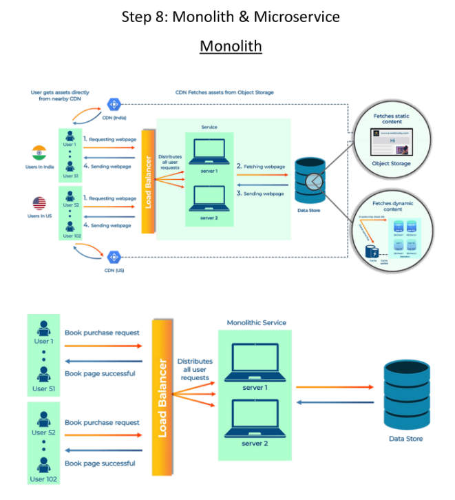
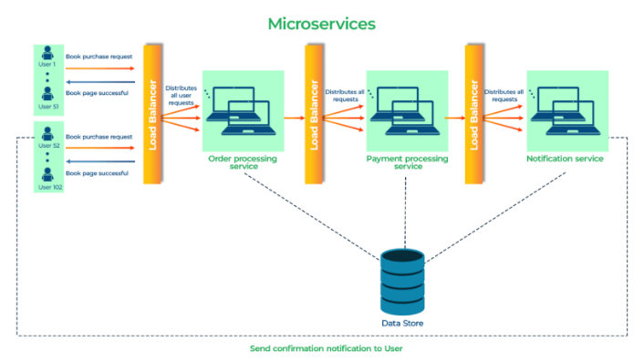

# 🏢🆚🛠️ **Monolith vs. Microservices**

---

## **🤔 What is a Service?**

Before diving in, let's define a service. A service is a set of servers dedicated to handling a specific task. Think of it as a specialized worker responsible for a particular job. 👷‍♂️

---

## **📚 Scenario: Online Book Store**

Imagine our website sells books. This involves three main tasks:

1. Take the order 📦
2. Process the payment 💳
3. Send a confirmation notification 📨

---

## **🏢 Approach 1: Monolithic Architecture**

In a monolithic architecture, all these tasks are handled by a single service. It's like one giant robot performing all the functions: taking orders, processing payments, and sending notifications. All user requests go to a load balancer, which distributes them among the servers within this single service. 🤖

 📊

---

## **🛠️ Approach 2: Microservices Architecture**

In a microservices architecture, each task has its dedicated service:

- **📦 Order Processing Service**
- **💳 Payment Processing Service**
- **📨 Notification Service**

It's like having three specialized robots, each responsible for a specific task. Each service has its own load balancer. The Order Processing Service handles the order, then calls the Payment Processing Service, and finally, the Notification Service sends a confirmation to the user. 🤖🤖🤖

 📊

---

## **🆚 Monolithic vs. Microservices: Key Differences**

| Feature | Monolithic 🏢 | Microservices 🛠️ |  
| :---- | :---- | :---- |  
| **Architecture** | Single unit | Multiple independent services |  
| **Deployment** | Deployed as a single application | Each service deployed independently |  
| **Scalability** | Scale the entire application | Scale individual services as needed |  
| **Technology** | Typically uses a single technology stack | Can use different technologies for different services |  
| **Complexity** | Simpler to develop initially | More complex to develop and manage |  
| **Fault Tolerance** | A failure in one part can affect the entire system | A failure in one service has minimal impact on others |  

---

## **🌟 Benefits of Microservices**

- **📈 Improved Scalability:** Scale individual services independently based on demand.
- **⚡ Increased Agility:** Develop, deploy, and update services faster.
- **🛡️ Enhanced Resilience:** Isolate failures to prevent widespread system outages.
- **🌐 Technology Diversity:** Use the best technology for each service.

---

## **⚠️ Challenges of Microservices**

- **🧩 Increased Complexity:** Managing communication and dependencies between services.
- **📊 Operational Overhead:** Monitoring and managing multiple services.
- **⚖️ Data Consistency:** Ensuring data consistency across different services.

---

## **🤔 Choosing the Right Approach**

The best approach depends on your specific needs and project complexity. Monoliths are often simpler for smaller projects, while microservices are better suited for large, complex systems that require high scalability and flexibility. 🎯

---

### **↩️ [Back](../README.md)**
