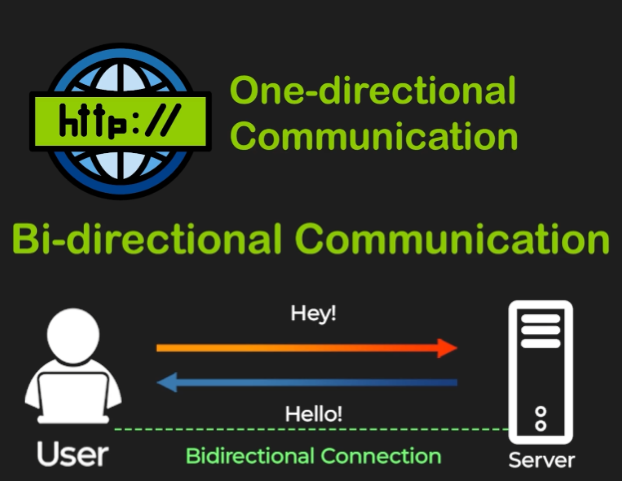
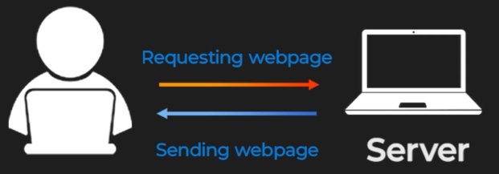
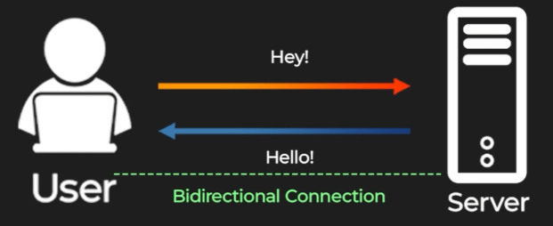
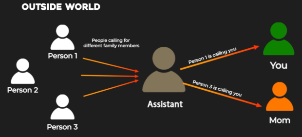
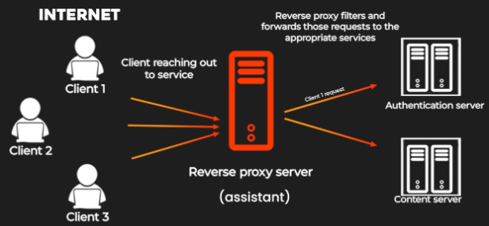

# **📡 Communication Protocols: Rules for Computer Communication** 🌐

## **🤔 Understanding Protocols**

Protocols are predefined sets of rules that dictate how data is transmitted and received over a network. Different tasks require different protocols to ensure smooth communication. 📜

---

### **📚 Examples of Protocols**

#### **🌐 HTTP (Hypertext Transfer Protocol)**

* **🎯 Purpose**: Facilitates common web interactions, such as:
  * 📄 Sending or receiving web pages
  * 🔄 Updating content on a server
* **💡 Use Case**: Accessing websites or performing actions like form submissions. 🖱️

---

#### **📂 FTP (File Transfer Protocol)**

* **🎯 Purpose**: Handles the transfer of files between computers over a network.
* **💡 Use Case**: Uploading or downloading files to and from a server. ⬆️⬇️

---

### **🎬 TCP (Transmission Control Protocol)**

Imagine you are streaming a movie, and after the first scene you suddenly see the climax. Totally confusing, right? 😵 TCP makes sure that doesn't happen. It’s a protocol that ensures your data packets are delivered in the correct sequence, so you watch the movie in the proper order. 🎥

---

#### **🔧 How TCP Works**

1. 💻 **Client Request**: The client asks the server for the Harry Potter movie.
2. 🖥️ **Server Response**: The server sends the data packets (or "movie scenes") back to the client.
3. 🎞️ **Order Guaranteed**: TCP ensures the scenes are in the right order, preventing jumbled playback.

---

### **⚡ UDP (User Datagram Protocol)**

Imagine you're watching a live football game. There is emphasis on the word **live**. You want the action to feel as real-time as possible with no delay, even if that means missing a few seconds of footage here and there. UDP is perfect for this. ⚽

---

#### **🔑 Key Features of UDP**

* **🚀 Speed over Accuracy**: Unlike TCP, which focuses on delivering every part of the data in order, UDP prioritizes speed. It sends data super fast, even if it skips a bit here and there.
* **💡 Use Case**: Great for live events where being up-to-the-second is more important than perfect accuracy. ⏱️

---

#### **🔧 How UDP Works**

1. 📱 **Client Request**: Your device requests to watch a live football game from the server.
2. ⚡ **Fast Delivery**: UDP starts sending the video stream as quickly as possible.
3. 📹 **Trade-Off**: Some parts of the stream might be missed (e.g., 4 to 6 seconds of footage), but the live action remains current.

This trade-off is why, during live-streaming, you might notice brief skips in the action. It’s all because UDP is working to keep things fast and lively. ⚡

---

## **🌐 HTTP (Hypertext Transfer Protocol)**

HTTP is one of the most commonly used protocols on the internet. Think of it as a back-and-forth conversation between a client and a server. 💬

---

#### **🔧 How It Works**

1. 💻 **Client Request**: The client (e.g., your browser) asks for something from the server.
2. 🖥️ **Server Response**: The server responds with the requested data. 📤📥

---

#### **📚 Example**

* When you click on a product while shopping online:
  * 💻 **Client Request**: Your browser sends a request to the server.
  * 🖥️ **Server Response**: The server fetches the product details and sends them back. 🛒

---

#### **Diagram Explanation**

1. 💻 **Client Request**: The client requests a web page from the server.
2. 🖥️ **Server Response**: The server fetches the required data and sends it back to the client.
3. 🖼️ **Display**: The web page becomes visible on your screen. 🖥️

This process ensures seamless interaction and data retrieval during everyday web activities. 🌐

---

### **🔌 WebSockets Protocol**

WebSockets enable **bidirectional communication**, unlike traditional protocols like HTTP, which are one-directional. 🔄

---

#### **🎯 Purpose**

* Allows the client and server to exchange data freely in real time.
* **💡 Use Case**: Applications like live chat or real-time notifications. 💬🔔

---

#### **🔧 How It Works**

1. 🔄 **Bidirectional Communication**: Both the client and server can initiate communication.
2. 📩 **Real-Time Data Exchange**: Messages are exchanged directly and continuously.
3. 🔗 **Persistent Connection**: The connection remains open, facilitating an uninterrupted flow of data.

---

#### **📚 Example**

* **💬 Live Chat Application**: Instead of the client repeatedly asking the server, “Do you have a new message?” WebSockets allow the server to push new messages to the client instantly. This creates an efficient and real-time communication channel. 📩

---

#### **Diagram Overview**

1. 🔗 **Connection Established**: The client establishes a WebSocket connection with the server.
2. 🔄 **Data Exchange**: Both client and server can exchange messages directly and continuously.
3. 🚀 **Efficient Communication**: The connection remains open, ensuring real-time interaction.

This makes WebSockets a powerful protocol for applications requiring continuous and efficient communication between the client and server. 💪

---

## **🛡️ Forward Proxy and Reverse Proxy**

### **🛡️ Forward Proxy**

A forward proxy acts as an intermediary between a client and the internet. Think of it as your personal assistant who fetches things for you. 🕴️

---

#### **🔧 How It Works**

1. 💻 **Client Request**: The client requests data from the internet.
2. 🕴️ **Proxy Retrieval**: The forward proxy retrieves the data on behalf of the client.
3. 📥 **Data Delivery**: The proxy returns the data to the client.

---

#### **📚 Example**

* Imagine you need vegetables from the market. Instead of going yourself, you ask your assistant (the forward proxy) to fetch them for you. 🥕

* Similarly, when your computer (the client) needs data from the internet, it asks the forward proxy to retrieve it. The forward proxy fetches the data and delivers it back to your computer. 💻

---

### **🛡️ Reverse Proxy**

A reverse proxy acts as an intermediary on behalf of servers, shielding them from direct exposure to external requests. Think of it as a personal assistant for your family. 👨‍👩‍👧‍👦

---

#### **🔧 How It Works**

1. 🌐 **External Request**: External requests first reach the reverse proxy.
2. 🛡️ **Filtering**: The proxy filters and decides which requests to forward to the servers.
3. ⚖️ **Load Balancing**: It may also balance the load among multiple servers.

---

#### **📚 Example**

* Imagine the external world is trying to contact your family.
* Instead of everyone reaching your family members directly, all requests go through your assistant (the reverse proxy).
* The assistant decides which requests are important and filters out unnecessary ones. 🛡️

* External users attempt to access a website.
* The reverse proxy handles these requests, forwarding them to appropriate servers and filtering unnecessary traffic. 🌐

---

#### **🌟 Benefits**

* **🛡️ Forward Proxy**: Enhances privacy and security for clients.
* **🛡️ Reverse Proxy**: Provides load balancing, security, and protection for servers. ⚖️🛡️

In a network, the reverse proxy filters and manages incoming requests, ensuring smooth and secure communication between external clients and internal servers. 🌐

---

## **🎯 Conclusion**

Protocols serve as the foundation for computer communication, ensuring tasks are performed efficiently and reliably. By using the appropriate protocol for each task, we enable seamless interaction in the digital world. 🌐💻

---

### **🔙 [Back](../README.md)** ↩️