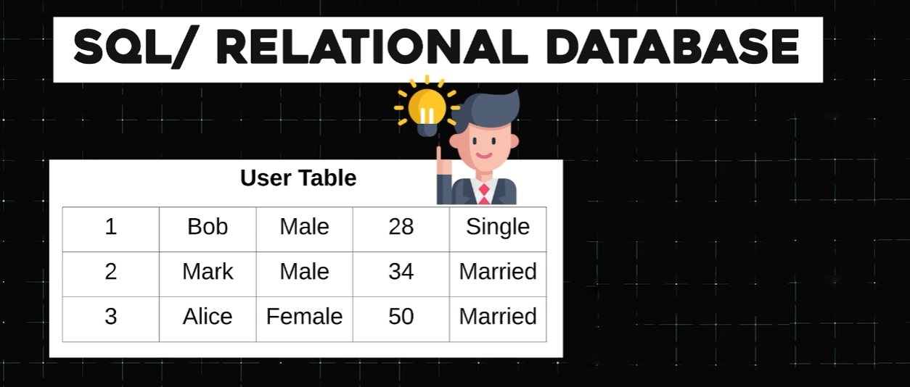
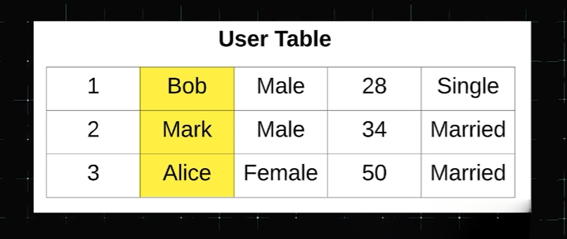
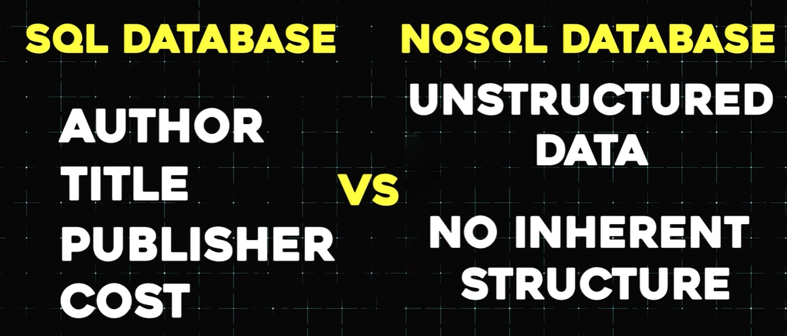

# Introduction to Relational Databases (SQL) 📊

## **🧑‍💻 Introduction to Relational Databases with Hardy**

### 🎉 Welcome
  
  
🌐 In this lesson, we’ll explore the world of **relational databases** or **SQL**.

---

### 📑 Initial Analogy: Spreadsheets and Tables
📊 Have you ever worked with **tables** or **spreadsheets**?  
💡 If so, you already have a good idea of how relational databases work.  
🔍 This is the closest analogy I can give for a relational database.

---

### 🗂️ What is a Relational Database?

📈 Relational databases (or SQL databases) store data in a **tabular format**, similar to a spreadsheet.  
📝 **Rows** represent individual records.  
🏷️ **Columns** represent specific attributes or fields.

---

### 🎯 When to Use Relational Databases?

✅ They are ideal for data with a **well-structured format** that can easily fit into rows and columns.  
👤 **Example:** User data.  
🪪 This data is structured because it can be organized into predefined fields, such as:
- 📧 Email
- 📞 Phone number
- 🏠 Address

---

### 💾 Examples of Relational Databases
🐬 Some popular examples include:
1. **MySQL**
2. **PostgreSQL** 🐘

---

### 📚 Analogy: An Organized Library
🏫 Think of a relational database as a **well-organized library**.  
✍️ Each book is categorized and placed in a specific location based on:
- 📖 Title
- 🏢 Publisher
- 💰 Cost

---

### ⚖️ Structured vs. Unstructured Data

📚 **Structured Data:**
- Organized and follows a clear format (like a library).  
  📊 Example: Database tables.

📦 **Unstructured Data:**
- Like a **storage room** filled with random items.  
  🖼️ Example: Boxes of documents, photos, videos, furniture, etc.  
  🌀 There is no inherent structure to organize these items.

---

### 🎯 Conclusion
💪 Relational databases are powerful tools for storing and managing structured data.  
📚✨ They provide an efficient way to organize information, just like a library organizes books.

---

### ↩️ 🔙 [Back](../README.md)
