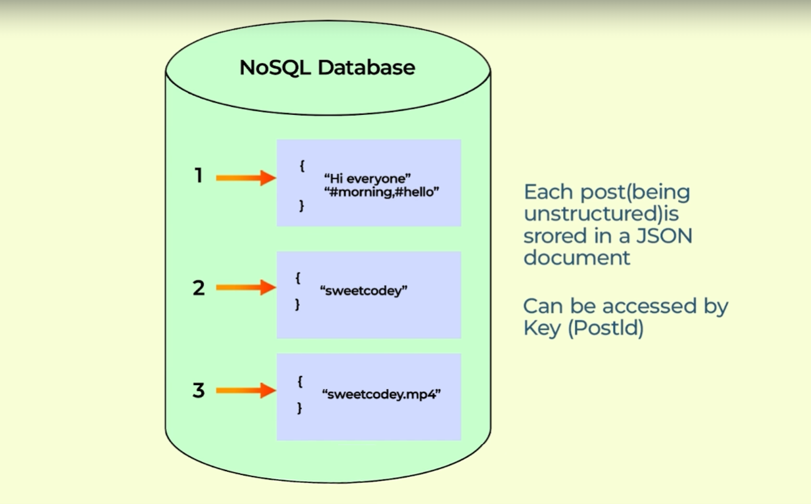

# Introduction to NoSQL Databases 🗄️

## **🧩 Handling Unstructured Data with NoSQL**

---

### ❓ What Happens When Data Isn’t Structured?
🧩 But what happens when our data doesn’t fit neatly into predefined categories or is **unstructured**?  
📱 Let’s consider **social media posts** as an example.

---

### 🖼️ Example: Social Media Posts

📊 Imagine trying to store these posts in a table with columns for **text**, **images**, and **videos**.  
🚫 If a post contains only text, the **image** and **video** columns remain empty.  
🚫 If a post includes a video, the **text** and **image** columns remain empty.  
⚠️ This results in a lot of **wasted space** in our table, which isn’t very efficient.

---

### 📊 Visualizing the Problem

🚫 Here, you can see how the table has many **empty entries** because each post doesn’t always have content in every column.  
⚠️ This inefficiency arises because the table is designed for **structured data**, but social media posts don’t always follow a strict structure.  
📦 They are more like **random items in a storeroom**—lacking a predefined format.

---

### 🛠️ Introducing NoSQL Databases
🗄️ This is where **NoSQL databases** come into play. They are ideal for handling **unstructured data**.  
📄 Instead of forcing everything into a rigid table, NoSQL databases allow you to store each post **as it is**.  
📝 Each post can be stored in a **flexible format**, such as a **JSON document**, which can accommodate various types of data:  
🖼️ Images  
🎥 Videos  
📝🖼️ Text and images  
📝🎥 Text and videos  
🧩 Or anything else!

---

### 📄 Visualizing NoSQL Storage
🖼️ Let’s take a look at the second diagram: 

📄 Here, you can see how each social media post is stored as a **JSON document** in a NoSQL database.  
✅ Each post is **self-contained within its own document**, eliminating **wasted space**.  
🔑 These documents can be easily accessed using a **key**, such as a post ID, making data retrieval quick and efficient.

---

### 🌟 Cool Fact: Types of NoSQL Databases
🗂️ NoSQL databases aren’t limited to a single type. There are various kinds, each designed to handle different types of unstructured data:  
🔑 **Key-Value Stores**  
📄 **Document Databases** (like the one we examined)  
🌐 **Graph Databases** (for managing relationships)  
📊 **Wide-Column Databases**  
⏰ **Time-Series Databases** (for tracking data over time)

---

### 🏆 Popular Examples of NoSQL Databases
🍃 **MongoDB**  
🐝 **Cassandra**  
⚡ **DynamoDB**

These databases are designed to be **highly scalable** and **flexible**, making them perfect for modern applications that deal with a variety of data types—whether unstructured, structured, or anything in between.

---

### 🎯 Why NoSQL?
📦 Just as a storeroom can handle all sorts of items without strict organization, **NoSQL databases** are perfect for managing **unstructured and varying data**.  
✨ They provide the **flexibility** to store and manage data in a way that suits your needs, without wasting space or forcing everything into a rigid structure.

---

### ↩️ 🔙 [Back](../README.md)