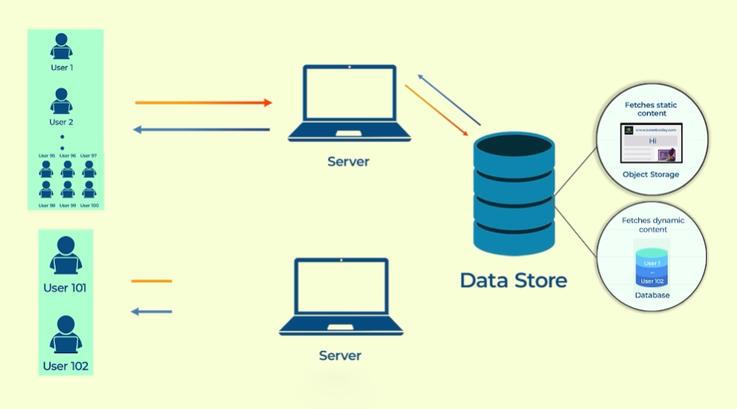
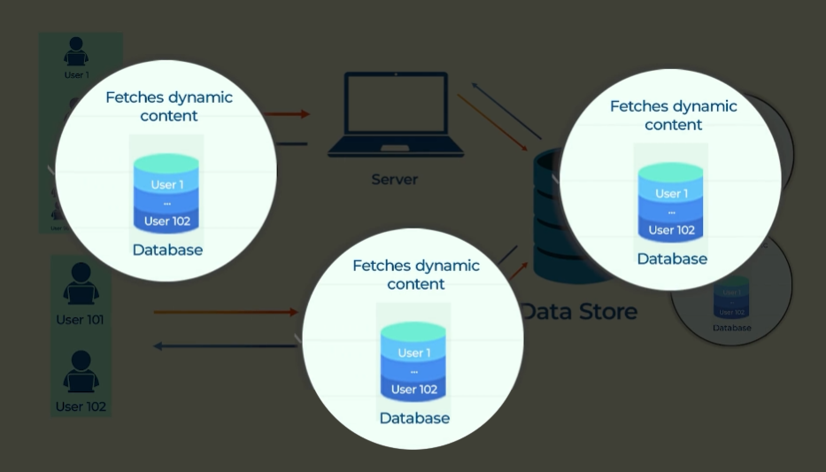
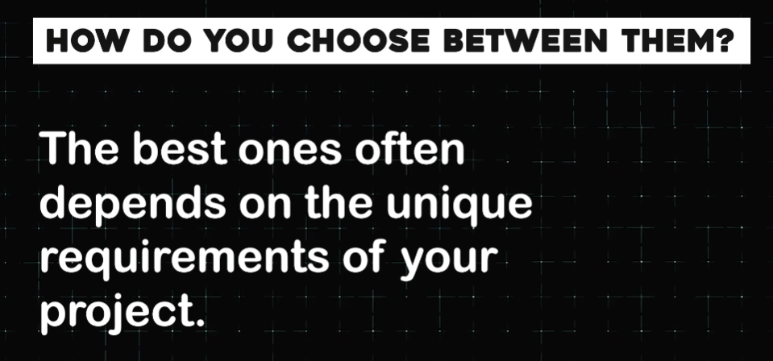

# Choosing Between SQL and NoSQL Databases 🗂️

## **🧩 SQL vs. NoSQL: How to Choose the Right Database**

📚 Now that we’ve explored both **SQL** and **NoSQL databases**, the natural question is: **How do you choose between them?**  
🔍 Let’s dive into some general guidelines to help you decide. But remember, it’s not always black and white—your choice will often depend on the specific needs of your project.

---

### 🚀 First: Speed
⚡ If you need **very fast data access**, NoSQL databases might be the better choice.  
📊 NoSQL databases are designed to handle **large volumes of data** and can retrieve information quickly, making them ideal for **real-time applications**.

---

### 📈 Next: Scale

🌍 When dealing with **large-scale data**, NoSQL databases tend to outperform SQL databases.  

🛠️ NoSQL databases are built to **scale horizontally**, meaning you can add more servers to handle increasing amounts of data.  
📱 This makes them perfect for applications with **massive data needs**, like social media platforms or big data applications.

---

### 🧩 What if Your Data is Structured?
📊 If your data fits into a **fixed structure**, SQL databases are the way to go.  
👤 For example, **user data** with predefined fields like name, email, phone number, and address works perfectly with SQL databases.

---

### 🎨 What if Your Data is Unstructured?
📦 If your data **doesn’t fit into a fixed structure**, NoSQL is the better choice.  
📱 Remember our example of **social media posts**? That kind of unstructured data is ideal for NoSQL databases.

---

### 🔍 Complexity of Queries
🧠 If your application requires **complex queries** involving multiple tables, joins, or filtering, SQL databases are the better choice.  
📝 SQL databases are designed for **intricate querying**.

📄 On the other hand, if your queries are **simpler and more straightforward**, NoSQL databases can handle them efficiently.  
⚡ They are optimized for **quick, easy access** without the need for complex operations.

---

### 🛠️ Flexibility
🔄 If your data **changes frequently** or is likely to evolve over time, NoSQL databases are the better option.  
📄 NoSQL databases support **flexible structures**, allowing you to add new fields or change data formats without hassle.  
🚀 This is particularly useful for **rapidly evolving applications** where the data model isn’t set in stone.

---

### 🏁 Summary: SQL vs. NoSQL
📊 **SQL Databases** are great for:
- Structured data
- Complex queries
- Applications with consistent data formats

📦 **NoSQL Databases** are perfect for:
- Unstructured data
- Large-scale applications
- Scenarios where **flexibility** and **speed** are key

---

### 💡 Key Takeaway
🧩 Flexibility and adaptability can take you much further than rigidity.  
🌱 In both databases and life, the ability to **evolve with the times** can be the key to success.

---

### 🎯 Final Thoughts

🔧 Remember, these are just **general guidelines**. The best choice often depends on the **unique requirements** of your project.  
🛠️ It’s all about finding the **right tool for the job**.

---

### ↩️ 🔙 [Back](../README.md)