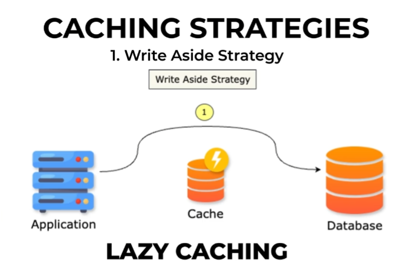
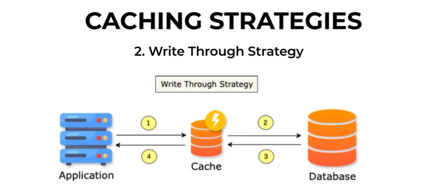
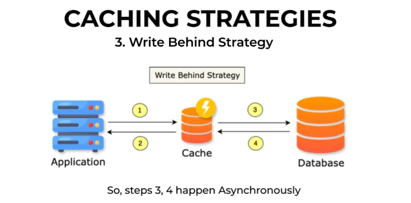

### Structured Document for Study: Caching Strategies (Write Strategies) 🗂️

---

### **Introduction** 🌟
Caching strategies are essential for optimizing data storage and retrieval in systems. While reading strategies focus on fetching data efficiently, **write strategies** determine how data is written to the cache and database. In this document, we will explore three common write caching strategies: **Write Aside**, **Write Through**, and **Write Behind**.

---

### 🔄 **1. Write Aside Strategy** 

#### **How It Works?** 🛠️
1. **📥 Step 1: Write to Database**
    - Data is directly written to the database, bypassing the cache entirely.
    - The cache is not updated during the write operation.

2. **🔄 Step 2: Cache Update on Read**
    - When the data is read, the system first checks the cache.
    - If the data is **not** in the cache (**cache miss**), it is fetched from the database.
    - The cache is then updated with the fetched data for future reads.

#### 🔑 **Key Characteristics** 
- **Reactive Cache Update:** The cache is updated only when a read operation encounters a cache miss.
- **Lazy Caching:** Also known as **lazy caching** because the cache is updated on demand rather than proactively.

#### 👍 **Advantages** 
- **Simplicity:** Easy to implement as the cache is not involved during writes.
- **Efficiency:** Reduces unnecessary cache updates during write operations.

---

### 📖➡️ **2. Write Through Strategy** 

#### **How It Works?** 🛠️
1. **📥 Step 1: Write to Cache**
    - Data is first written to the cache.

2. **📂 Step 2: Write to Database**
    - The cache immediately updates the database synchronously.

3. **✅ Step 3: Confirmation to Application**
    - The application receives confirmation only after both the cache and database have been updated.

#### **Key Characteristics** 🔑
- **Synchronous Updates:** The cache and database are updated in a sequential, synchronous manner.
- **Strong Consistency:** Ensures that the database is always up-to-date with the cache.

#### **Advantages** 👍
- **Consistency:** Guarantees that the database reflects the latest data.
- **Reliability:** The application is assured that both the cache and database are updated before proceeding.

---

### 📥➡️📂 **3. Write Behind Strategy** 

#### **How It Works?** 🛠️
1. **📥 Step 1: Write to Cache**
    - Data is first written to the cache.

2. **✅ Step 2: Confirmation to Application**
    - The application receives confirmation immediately after the cache is updated.

3. **📂 Step 3: Asynchronous Database Update**
    - The cache updates the database **asynchronously** after confirming the write to the application.

#### 🔑 **Key Characteristics** 
- **Asynchronous Updates:** The database update happens in the background after the cache is updated.
- **Improved Performance:** Reduces latency for write operations since the application does not wait for the database update.

#### **Advantages** 👍
- **Speed:** Faster write operations as the application does not wait for the database update.
- **Scalability:** Suitable for high-write throughput systems.

---

### **Comparison: Write Aside vs. Write Through vs. Write Behind** ⚖️

| **Aspect**            | **🔄 Write Aside**                        | **📖➡️ Write Through**                  | **📥➡️📂 Write Behind**                |
|------------------------|------------------------------------------|-----------------------------------------|-----------------------------------------|
| **Write to Cache**     | No                                       | Yes                                     | Yes                                     |
| **Write to Database**  | Directly                                 | Synchronously                           | Asynchronously                          |
| **Cache Update**       | On read (cache miss)                    | During write                            | During write                            |
| **Performance**        | Efficient for reads                     | Slower writes (synchronous)             | Faster writes (asynchronous)            |
| **Consistency**        | Eventual consistency                    | Strong consistency                      | Eventual consistency                    |

---

### 🎯 **Conclusion** 
Each write strategy has its own strengths and trade-offs, making them suitable for different use cases:

- **🔄 Write Aside:** Ideal for systems where write performance is critical, and cache updates can be deferred.
- **📖➡️ Write Through:** Best for systems requiring strong consistency between the cache and database.
- **📥➡️📂 Write Behind:** Suitable for high-write throughput systems where performance is a priority.

--- 

This document provides a clear and visually structured overview of write caching strategies, making it easier to study and apply these concepts in real-world systems. 🚀

---

### **Additional Notes** 📝
- **📥 Write to Cache:** Data is written to the cache.
- **📂 Write to Database:** Data is written to the database.
- **✅ Confirmation:** Application receives acknowledgment of the write operation.
- **🔄 Reactive Update:** Cache is updated only when needed (e.g., on a cache miss).
- **📖➡️ Synchronous Update:** Cache and database are updated sequentially.
- **📥➡️📂 Asynchronous Update:** Database update happens in the background after cache update.

---

### ↩️ 🔙 [Back](../README.md)