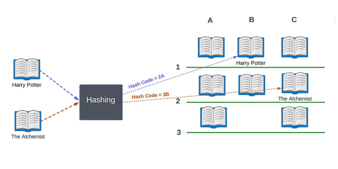
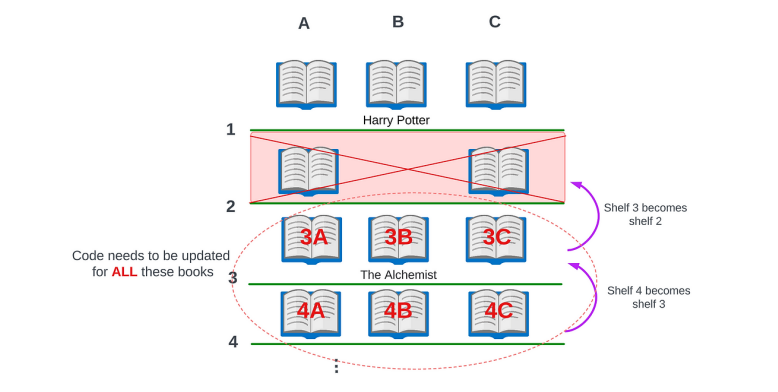
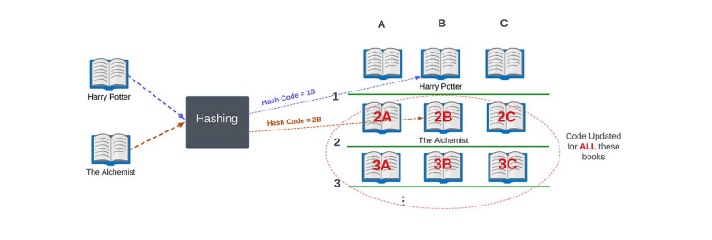

# **🔢 Understanding Hashing & Consistent Hashing**

## **📖 What is Hashing?**

📚 Imagine a library where each new book gets a **unique numeric code**. The librarian uses this code to quickly place and retrieve books without searching by title.

🔍 Hashing works the same way—it converts data into a **short, unique code**. This makes data storage and retrieval **fast and efficient**.

---

## **📚 Why Does Reorganization Cause Issues?**

📦 Let’s say we **rearrange the bookshelves**. If a shelf is removed, we must shift all books forward, changing their assigned codes.

#### **Example in Action**

1. We remove **shelf 2**, shifting all shelves.
2. The book "The Alchemist" was on **shelf 3**, coded as **3B**.
3. Now, shelf 3 becomes shelf 2, so "The Alchemist" gets a new code **2B**.

🚨 If we **don’t update the system**, users searching for "The Alchemist" at **3B** won’t find it, causing confusion.

---

## **🔄 How Consistent Hashing Helps**

🧠 **Consistent Hashing** is a smarter algorithm that minimizes reorganization issues.

🔹 Instead of **reassigning all books**, only a **few codes** need to be changed, making management much easier.

🔹 Even when shelves change, **most books keep their original codes**, preventing unnecessary updates.

🚀 Think of it as a **magic algorithm** that saves time and reduces effort in large-scale systems.

---

## **🎯 Final Thoughts**

🔑 **Hashing** speeds up data retrieval, while **Consistent Hashing** makes storage **more efficient** by reducing disruptions when changes occur.

📌 While we won’t dive into the technical details, just remember that **consistent hashing** helps prevent massive reorganization headaches!

---

### ↩️ 🔙 [Back](../README.md)

